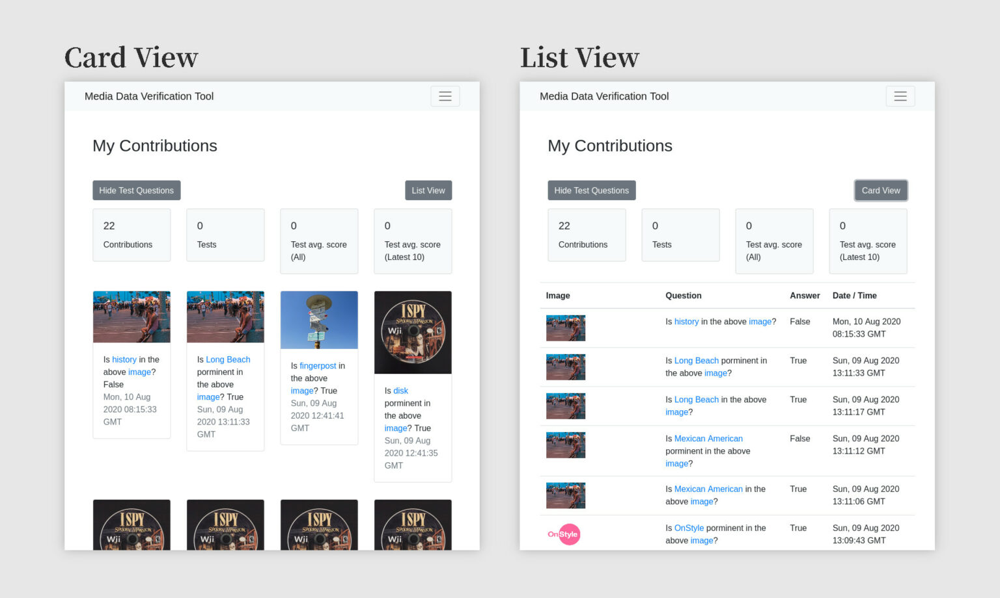

+++
date = '2020-08-11T08:19:00+01:00'
draft = false
title = 'GSoC Wikimedia Bi-Weekly Report 7'
categories = ['Google Summer of Code 2020']
+++

(This is part of a (mandatory) blog series documenting my experience in GSoC 2020 with Wikimedia Foundation. This series should serve for record-keeping purposes and as a reference for future GSoC students.)

## Added:Test Cases

We’ve added test cases using the module unittest to most route or util functions in all blueprints.

## Added:Moved Question Texts to Server

We wanted to focus all translation-needed strings to be on the server’s side, instead of on the client’s side. So we moved the question texts to the server, which is now available through an API call (/api/get-question-text).

## Added: Doc for API Methods

In preparation for the tool getting “published” (i guess that’s when GSoC ends? or maybe when we decide to tell the world that the tool is ready?), we added short documentation for all api methods.

## Added: List / Card View for “My Contributions” Page

We thought it’d be a great addition to let the user choose views for the “My Contributions” page. So here we have a list and a card view. There are still some stuff that we have to work on…

## Working On: Posting Edits to Commons

We’ll, given that most functions are in place and the tool is ready to take questions and have volunteers answer them, we think it’s about time we start posting edits to commons. So that’s what we’re working on for now.
